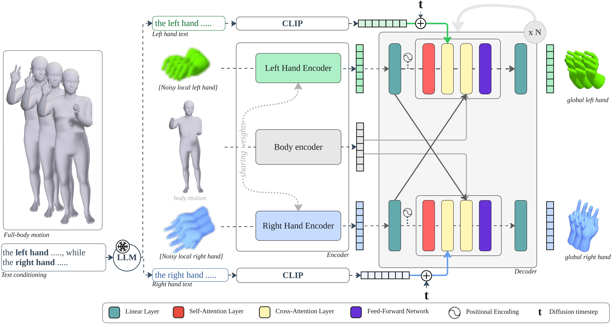

# AtHands
The official implmentation of the paper: **ATHands: Anatomy-Aware Diffusion Model for Text-Driven Hand Motion Generation**



## Installation


```shell
conda create -n AtHands python=3.9
conda activate AtHands
conda install pytorch==1.13.0 torchvision==0.14.0 torchaudio==0.13.0 pytorch-cuda=11.7 -c pytorch -c nvidia
pip install -r requirements.txt
```

## Datasets
We use [Both57M](https://github.com/Godheritage/BOTH2Hands/tree/main) dataset and [Motion-X](https://github.com/IDEA-Research/Motion-X/tree/main) dataset. Both datasets should be organized as follows:
```
---- Both57M
    ---- motions
        ---- motion_1.npy
        ---- motion_2.npy
        ---- ....
        ---- motion_n.npy

    ---- texts
        ---- text_1.txt
        ---- text_2.txt
        ---- ....
        ---- textn.txt

    ---- train.txt
    ---- val.txt
    ---- test.txt
```

## Training

Specify the training parameters in the `./scripts/train.sh` and run:

```shell
bash ./scripts/train.sh
```

## Evaluation
The trained model checkpoints are stored in `./checkpoints/dataset_name/exp_name/model/latest.tar`

For evaluation, we first generate the motion files using the trained model.
Specify the trained model parameters path, and the results folder in `./scripts/generate_results.sh` and run:

```shell
bash ./scripts/generate_results.sh
```
This will generate the motions corresponding to the test set (`test.txt`).

Then we use the same code as [Both2Hands](https://github.com/Godheritage/BOTH2Hands/blob/main/eval_encoder/eval_warper.py) for evaluation.

## Visualization
To generate a single prompt output, specify your prompt, the trained model parameters path and the output file name in `./scripts/visualize.sh`, then run: 

```shell
bash ./scripts/visualize.sh
```

Once generated, you can visualizate it using matplotlib or using [unity visualization](https://drive.google.com/file/d/1ci0GYSMjg00M5RSywf2K9sIS5fJJ7hc8/view). 

Here are some visualization examples.

<table>
<tr>
    <td></td>
    <td></td>
    <td></td>
</tr>
<tr>
    <td></td>
    <td></td>
    <td></td>
</tr>
</table>

## Updates
- [ ] Release trained models
- [ ] Release anatomical evaluation code
- [ ] Add more animations

## Acknowledgement

This code is developed on top of [MotionDiffuse](https://github.com/mingyuan-zhang/MotionDiffuse)